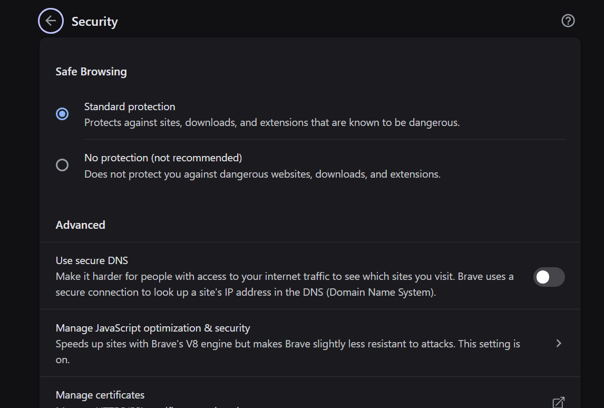
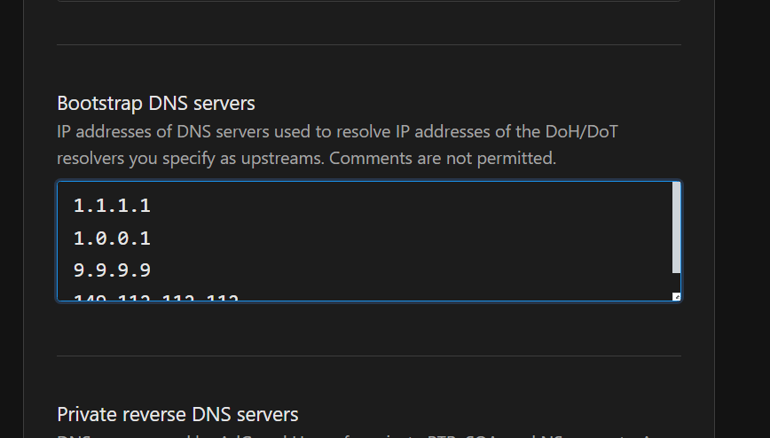
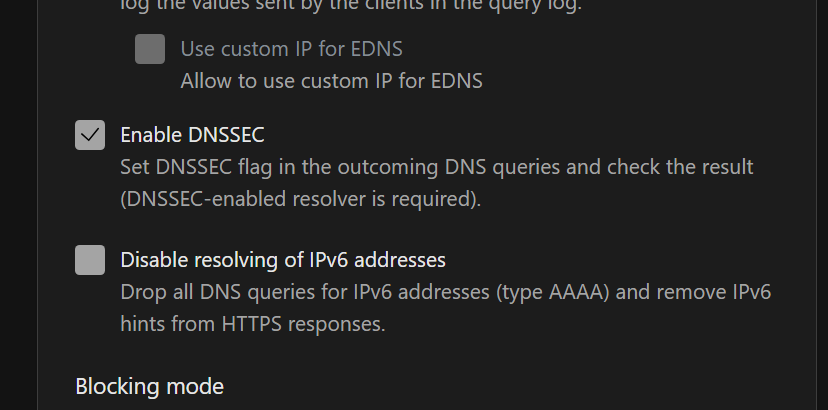
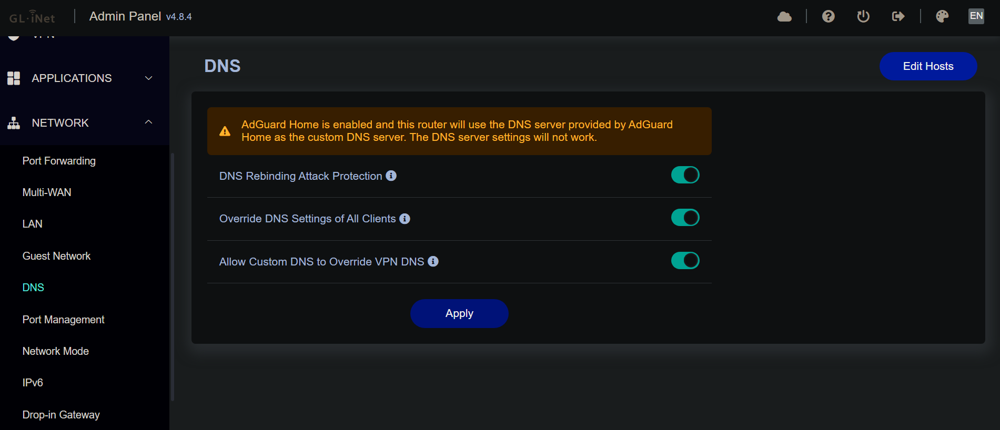
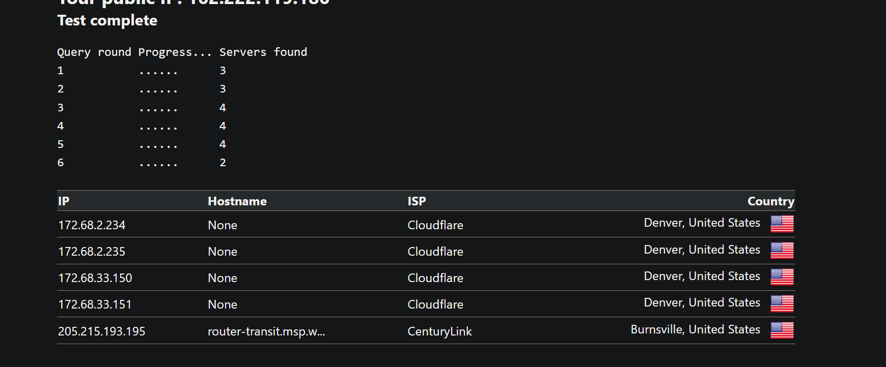
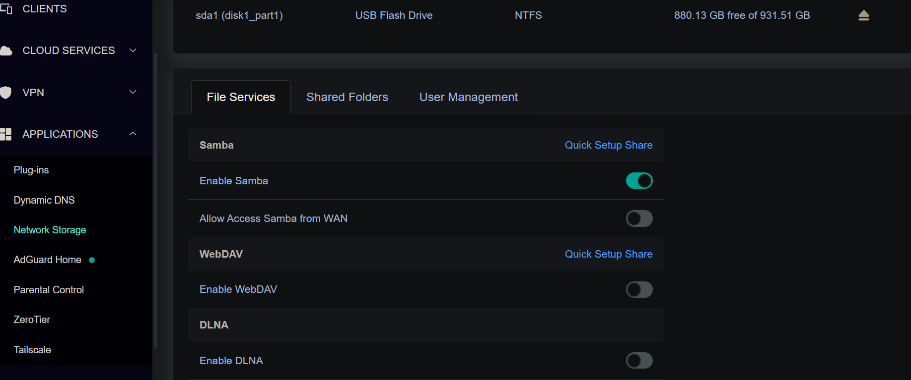
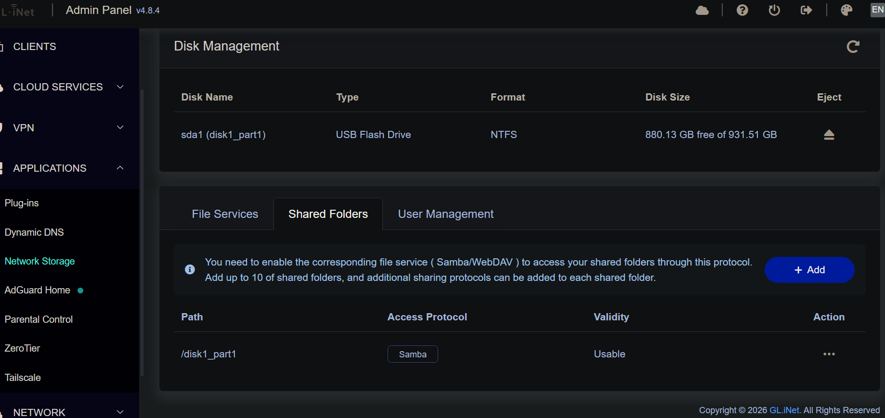
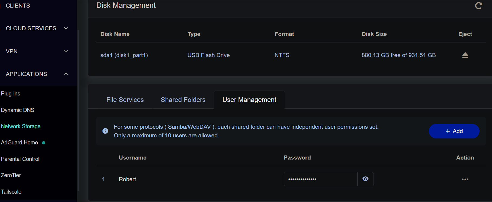

# Flint 2 SOHO Network & Homelab Setup


A home SOHO network build using a GL-iNet Flint 2 router, focused on security hardening, network-level ad and tracker blocking, encrypted DNS, private remote access via mesh VPN, and network-attached storage

---

## Table of Contents

- [Hardware](#hardware)
- [Initial Router Setup](#initial-router-setup)
- [DNS Filtering with AdGuard Home](#dns-filtering-with-adguard-home)
- [Encrypted DNS Configuration](#encrypted-dns-configuration)
- [Router DNS Settings](#router-dns-settings)
- [DNS Leak Testing](#dns-leak-testing)
- [Remote Access via Tailscale & RDP](#remote-access-via-tailscale--rdp)
- [Network-Attached Storage](#network-attached-storage)
- [Remote NAS Access](#remote-nas-access)
- [Known Limitations & Tradeoffs](#known-limitations--tradeoffs)
- [Upcoming Work](#upcoming-work)

---

## Hardware

| Component | Details |
|---|---|
| Router | GL-iNet Flint 2 (GL-MT6000) |
| NAS Drive | PNY Pro Elite V2 1 TB USB SSD |
| USB Connection | 3 ft USB 3.0 extension cable |
| Clients | Windows desktop, Android phone |

---

## Initial Router Setup

- Accessed router admin panel at `192.168.8.1`
- Configured separate 2.4 GHz and 5 GHz SSIDs with strong unique passwords
- Set wireless security to **WPA2/WPA3 mixed mode** for compatibility and modern security
- On the Windows client: set DNS to automatic via `Settings > Network > Ethernet > Edit DNS Settings`

---

## DNS Filtering with AdGuard Home

AdGuard Home runs on the router as a network-wide DNS sinkhole, blocking ads and malicious domains before they reach any device on the network.

**Blocklists used:**

| List | Purpose |
|---|---|
| AdGuard DNS Filter | General ads and trackers |
| OISD Blocklist Big | Broad malicious domain coverage |
| HaGeZi Pro++ | Advanced threat and tracker blocking |

Kept to three high-quality lists intentionally — more lists increase DNS lookup time and can cause false positives.

**Additional AdGuard settings:**
- Enabled **DNS rebinding protection** to prevent local network attacks
- Enabled **parallel upstream requests** for faster resolution
- Verified functionality via the AdGuard query log

**ProtonVPN compatibility fix:** Disabled the custom DNS setting inside ProtonVPN so all DNS queries route through AdGuard Home instead of being bypassed by the VPN client.

**Brave browser fix:** Disabled Brave's built-in secure DNS (DNS-over-HTTPS) to force all queries through AdGuard Home on the router.


*Brave's built-in secure DNS turned off so all queries route through AdGuard Home*

---

## Encrypted DNS Configuration

All DNS queries leaving the router are encrypted using **DNS-over-TLS (DoT)**, preventing ISP snooping on DNS traffic.

**Upstream DNS resolvers (DoT):**

```
tls://1.1.1.1         # Cloudflare
tls://1.0.0.1         # Cloudflare secondary
tls://9.9.9.9         # Quad9
tls://149.112.112.112  # Quad9 secondary
```


*AdGuard Home upstream DNS servers configured with DNS-over-TLS*

**Bootstrap DNS servers** (used to resolve the DoT hostnames on startup):

```
1.1.1.1
1.0.0.1
9.9.9.9
149.112.112.112
```


*Bootstrap servers match the upstream resolvers to avoid a circular dependency on startup*

**Additional settings enabled:**


*DNSSEC enabled — validates DNS responses to protect against spoofing and cache poisoning*

---

## Router DNS Settings

Configured at `Network > DNS` in the GL-iNet admin panel:



| Setting | Status | Purpose |
|---|---|---|
| DNS Rebinding Attack Protection | ✅ Enabled | Prevents malicious DNS from pointing to internal IPs |
| Override DNS Settings of All Clients | ✅ Enabled | Forces all devices to use AdGuard Home regardless of their own DNS config |
| Allow Custom DNS to Override VPN DNS | ✅ Enabled | Ensures AdGuard Home stays in control even when VPN is active |

> **Note:** The admin panel shows a warning that AdGuard Home is active and will take over as the DNS server — this is expected and confirms AdGuard Home is working correctly.

---

## DNS Leak Testing

After configuration, multiple DNS leak tests were run to verify no queries were escaping outside the intended encrypted path.


*DNS leak test showing only Cloudflare resolvers responding — no ISP DNS visible*

All servers found belong to Cloudflare (the configured upstream provider), confirming:
- No ISP DNS leakage
- Encrypted DoT tunnel is functioning
- AdGuard Home is intercepting all queries correctly

> A second test pass showed Datacamp-hosted IPs, which are part of Cloudflare's anycast infrastructure — this is normal and expected behavior, not a leak.

---

## Remote Access via Tailscale & RDP

Configured Windows Remote Desktop access over **Tailscale mesh VPN** instead of traditional port forwarding. This avoids opening any inbound ports on the firewall — significantly more secure than standard RDP exposure.

**Setup steps:**

1. Switched Windows network profile to **Private**
2. Installed Tailscale on Windows and Android
3. Configured **split tunneling in ProtonVPN** to exclude Tailscale from the VPN tunnel:
   - Excluded: `tailscale.exe` and `tailscaled.exe`
   - This allows ProtonVPN and Tailscale to run simultaneously on Windows
4. Enabled **Remote Assistance** in Windows (was previously disabled by O&O ShutUp10 — re-enabling this was required for RDP to function)
5. Verified LAN RDP connection successfully
6. Tested remote access off-network by switching phone to cellular — confirmed working

---

## Network-Attached Storage

A 1 TB USB SSD is connected to the Flint 2 for shared network storage accessible from all devices.

**Hardware note:** Used a 3 ft USB 3.0 extension cable to position the drive away from the router antennas and avoid potential 2.4 GHz interference.

**Setup steps:**

1. Confirmed USB connection was negotiating at **USB 3.0** speed in the admin panel
2. Formatted drive as **NTFS** — chosen for full read/write compatibility with Windows (ext4 would offer better Linux/router-native performance but would require additional drivers for Windows access)
3. Enabled **Samba** file sharing: `Admin Panel > Network Storage > Enable Samba`


*Samba enabled with WAN access intentionally disabled — share is LAN and Tailscale only*

4. Configured shared folder pointing to `/disk1_part1`


*Drive mounted as sda1, NTFS format, 880 GB free of 931 GB total, shared via Samba*

5. Created a dedicated Samba user with a strong password and **read/write permissions**


*Dedicated user created with password authentication — no anonymous access permitted*

**Windows client setup:**
- Mapped the NAS as a network drive via `File Explorer > This PC > Map Network Drive`
- Used separate Samba credentials and enabled **Reconnect at sign-in**

**Android client setup:**
- Installed **CX File Explorer**
- Added the Samba share as a network location — straightforward setup within the app

---

## Remote NAS Access

Enabled Tailscale directly on the Flint 2 router for secure remote access to the NAS from anywhere.

- Activated via: `Admin Panel > Applications > Tailscale`
- With Tailscale running on the router itself, the NAS is accessible remotely without needing a separate device to be awake and acting as a gateway
- Remote clients connect to the router's Tailscale IP and access the Samba share the same way as on the local network

---

## Known Limitations & Tradeoffs

| Issue | Details |
|---|---|
| Android VPN slot conflict | Stock Android allows only one active VPN at a time. Tailscale and ProtonVPN cannot run simultaneously — must disconnect ProtonVPN to use Tailscale remote access on Android. |
| NTFS vs ext4 | NTFS chosen for Windows compatibility. ext4 would give better native performance on the router but limits direct Windows access without extra drivers. |
| O&O ShutUp10 | Remote Assistance was blocked by a privacy hardening tool. Required manual re-enable for RDP to function. |

---

## Upcoming Work

- [ ] **IoT VLAN — Google TV isolation:** Configure a dedicated VLAN for a wifi-only Google TV to isolate it from the main trusted network. Smart TVs and streaming devices are known data collectors; a VLAN prevents lateral movement to other LAN devices while still allowing internet access. Will document VLAN tagging, inter-VLAN firewall rules, and any AdGuard Home client profile separation per VLAN.
- [ ] Investigate WireGuard site-to-site or Tailscale exit node as a solution to the Android single-VPN-slot limitation
- [ ] Test and document Tailscale RDP stability over varied network conditions
- [ ] Explore ext4 formatting with appropriate Windows drivers for improved NAS performance
- [ ] Document AdGuard Home query log and blocked domain statistics over time

---

*Built and documented as part of a personal homelab for hands-on networking and security practice.*
